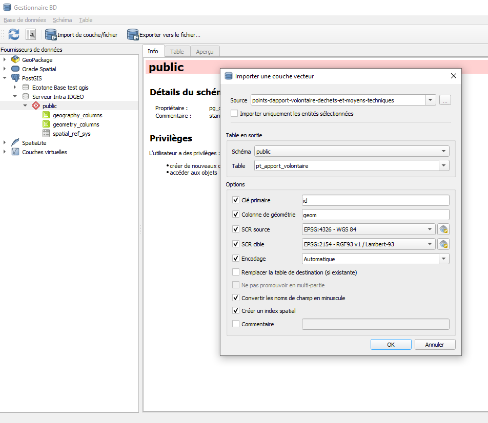

### Tp PostGIS - Déchets Toulouse Métropole

On trouve, on charge, on valorise les "données" sur les déchets ou plus tôt les "Points d'apports volontaire".

### Préparation des données :

1. **Téléchargement des données** depuis le catalogue de Toulouse Métropole.

2. **Importation dans PostGIS** : Utiliser QGIS pour insérer les données dans une nouvelle base de données PostGIS.

3. **Lexique**

	PAV = Point Apport Volontaire

### Requêtes à réaliser

1. Lister tous les points d'apport volontaire (PAV) pour le verre.

2. Calculer le nombre total de PAV par commune.

3. Déterminer la distance moyenne entre les PAV et le centre-ville de Toulouse (à vous de choisir votre centre de Toulouse).

4. Identifier les zones sans PAV dans un rayon de 500 mètres.

5. Trouver les PAV situés dans des zones inondables.

6. Calculer la densité de PAV par kilomètre carré pour chaque quartier.

7. Lister les PAV accessibles aux personnes à mobilité réduite.

8. Identifier les PAV les plus proches des écoles.
   
9. Consignes pour le réaménagement. En vue d'optimiser la répartition des PAV

	9.1 Déterminer le nombre PAV textile à installer à moins de 50m d'une école.
	9.2 Déterminer le nombre PAV verre à déplacer qui serait actuellement à moins de 100 m d'une école.

10. Trouver les secteurs où les jours de collecte des ordures ménagères sont le lundi.

11. Calculer la longueur totale des routes parcourues pour la collecte des déchets par secteur.

### Rendu dans la zone de dépôt prévue à cet effet.

### Bonus => créer un fichier au format markdown de correction.